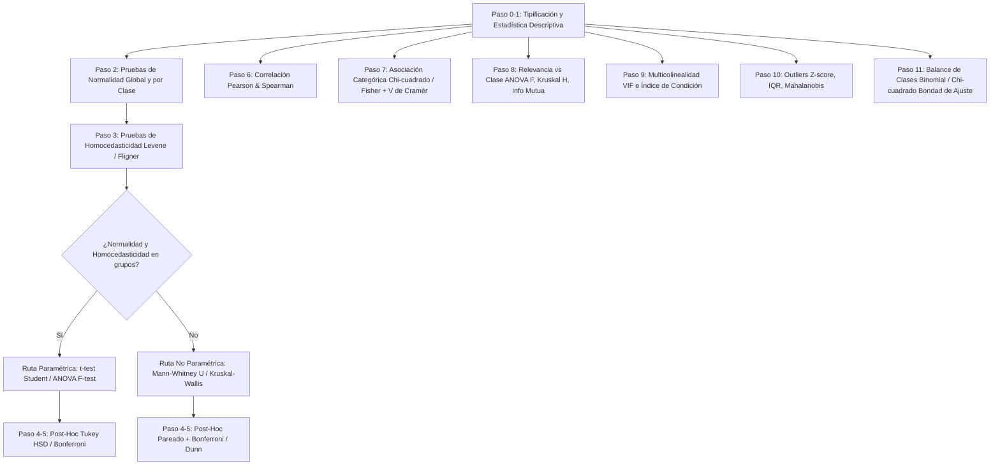

# Informe Consolidado: Revisión Estadística de Variables

**Curso:** Inteligencia Computacional (Maestría en Ciencias de la Información y las Comunicaciones - UDistrital)  
**Metodología:** Skill `classification-variable-stats-review` (`harness/skills/revisionVariables`)  
**Datasets analizados:**
1. **E. coli Dataset** (`3.Trabajos/1.en-casa-limpieza/ecoli/`)
2. **Bank Marketing Dataset (UCI & Bank Additional)** (`3.Trabajos/1.en-casa-limpieza/bank/`)

---

## 1. Marco Metodológico y Flujo de Decisión

El análisis sigue de forma estricta la cadena de justificación estadística previa al modelado:

---

## 2. Resultados: Dataset 1 — E. coli (`ecoli.data`)

### 2.1 Resumen del Dataset y Tipificación
- **Observaciones:** 336 instancias.
- **Identificador:** `sequence_name` (excluido del análisis cuantitativo).
- **Variable Objetivo (`class`):** 8 localizaciones celulares (`cp`, `im`, `pp`, `imU`, `om`, `omL`, `imS`, `imL`).
- **Variables predictoras Continuas:** `mcg`, `gvh`, `aac`, `alm1`, `alm2`.
- **Variables predictoras Categóricas/Binarias:** `lip` (0.48 / 1.0), `chg` (0.5 / 1.0).

### 2.2 Normalidad y Homocedasticidad
- **Prueba de Normalidad (Shapiro-Wilk):**
  - A nivel **global**, ninguna variable continua cumple normalidad ( < 0.001$).
  - A nivel **por clase**, existen clases donde se rechaza la normalidad (por ejemplo, `mcg` en `pp` con  = 4.01 	imes 10^{-8}$, `aac` en `im` con  = 3.83 	imes 10^{-5}$, `alm1` en `pp` con  = 0.0019$, `alm2` en `cp`, `im`, `imU`, `pp`).
- **Homocedasticidad (Test de Levene):**
  - `mcg` ( = 5.24 	imes 10^{-10}$), `gvh` ( = 0.0032$), `alm2` ( = 0.00059$) presentan **varianzas heterogéneas** entre clases.
  - `aac` ( = 0.720$) y `alm1` ( = 0.072$) presentan homogeneidad marginal.
- **Ruta Seleccionada:** Al violarse la normalidad y la homocedasticidad en la mayoría de grupos, la comparación multiclase se rige por **Kruskal-Wallis** (no paramétrica).

### 2.3 Comparación entre Clases y Relevancia
Todas las variables continuas son estadísticamente significativas para discriminar las 8 clases ( < 10^{-20}$ en Kruskal-Wallis):

| Variable | Kruskal-Wallis $ | 569Xvalor | Información Mutua | Ranking de Relevancia |
|:---|:---:|:---:|:---:|:---:|
| `alm1` | 257.1 | .74 	imes 10^{-52}$ | **0.6847** | 1 (Mayor capacidad discriminante) |
| `alm2` | 184.6 | .12 	imes 10^{-36}$ | **0.4703** | 2 |
| `mcg`  | 184.4 | .31 	imes 10^{-36}$ | **0.4257** | 3 |
| `gvh`  | 164.3 | .04 	imes 10^{-32}$ | **0.3738** | 4 |
| `aac`  | 115.9 | .45 	imes 10^{-22}$ | **0.2620** | 5 |

Para las binarias (`lip`, `chg`), la prueba $\chi^2$ arroja fuerte asociación con la localización ( < 10^{-30}$, {	ext{Cramér}} = 0.837$ y zsh.706$ respectivamente).

### 2.4 Multicolinealidad
- Fuerte correlación lineal y monótona entre `alm1` y `alm2` ({	ext{Pearson}} = 0.809$, $
ho_{	ext{Spearman}} = 0.715$).
- Factores de inflación de la varianza (VIF): `alm1` ( = 4.05$), `alm2` ( = 3.71$). Índice de condición: .03$. No hay colinealidad destructiva ( < 5$).

### 2.5 Outliers y Desbalance
- **Outliers:** `gvh` (13 atípicos por IQR), `aac` (9 atípicos por IQR). Mahalanobis multivariado identifica 6 instancias atípicas conjuntas.
- **Desbalance de Clases:** Severo ({	ext{chisq}} = 1.80 	imes 10^{-81}$). `cp` (143) e `im` (77) dominan la muestra, mientras `omL` (5), `imS` (2) e `imL` (2) son clases ultra-minoritarias.

---

## 3. Resultados: Dataset 2 — Bank Marketing (`bank-additional` y `bank`)

### 3.1 Resumen del Dataset y Tipificación
- **Observaciones:** 4,119 instancias (`bank-additional.csv`) y 4,521 instancias (`bank.csv`).
- **Variable Objetivo (`y`):** Binaria (`yes` / `no`).
- **Continuas:** `age`, `duration`, `campaign`, `pdays`, `previous`, variables socioeconómicas (`emp.var.rate`, `cons.price.idx`, `cons.conf.idx`, `euribor3m`, `nr.employed`, `balance`).
- **Categóricas:** `job`, `marital`, `education`, `default`, `housing`, `loan`, `contact`, `month`, `day_of_week`, `poutcome`.

### 3.2 Normalidad, Homocedasticidad y Comparación (2 clases)
- **Normalidad:** Rechazada de forma categórica para todas las variables numéricas tanto globalmente como condicionadas por =	ext{yes}$ e =	ext{no}$ ( < 10^{-10}$).
- **Homocedasticidad (Levene):** Fuerte heterogeneidad en `duration` ( = 1.97 	imes 10^{-76}$), `pdays` ( = 1.44 	imes 10^{-106}$), `nr.employed` ( = 7.48 	imes 10^{-29}$).
- **Ruta Seleccionada:** **Mann-Whitney U** (no paramétrica para 2 muestras independientes).

| Variable | Mann-Whitney $ | 569Xvalor | Significativo ($lpha=0.05$) | Interpretación |
|:---|:---:|:---:|:---:|:---|
| `duration` | .95 	imes 10^5$ | .08 	imes 10^{-110}$ | **Sí** | Variable más predictiva (duración de llamada) |
| `pdays` | .97 	imes 10^5$ | .91 	imes 10^{-101}$ | **Sí** | Días desde contacto previo |
| `nr.employed` | .23 	imes 10^6$ | .22 	imes 10^{-70}$ | **Sí** | Indicador económico trimestral |
| `euribor3m` | .23 	imes 10^6$ | .39 	imes 10^{-65}$ | **Sí** | Tasa Euribor diaria |
| `emp.var.rate` | .17 	imes 10^6$ | .45 	imes 10^{-50}$ | **Sí** | Tasa de variación de empleo |
| `previous` | .25 	imes 10^5$ | .02 	imes 10^{-43}$ | **Sí** | Número de contactos previos |
| `cons.price.idx` | .56 	imes 10^5$ | .42 	imes 10^{-8}$ | **Sí** | Índice de precios al consumidor |
| `campaign` | .16 	imes 10^5$ | .19 	imes 10^{-5}$ | **Sí** | Contactos en campaña actual |
| `cons.conf.idx` | .56 	imes 10^5$ | zsh.0027$ | **Sí** | Confianza del consumidor |
| `age` | .92 	imes 10^5$ | **0.1420** | **No** | No discrimina significativamente en mediana |

### 3.3 Asociación de Variables Categóricas vs Objetivo (`y`)
- **Variables con fuerte asociación ( < 10^{-10}$):**
  - `poutcome` ({	ext{Cramér}} = 0.332$,  = 2.04 	imes 10^{-99}$) — El resultado de campañas previas es el predictor categórico más fuerte.
  - `month` ({	ext{Cramér}} = 0.270$,  = 2.89 	imes 10^{-59}$) — Fuerte estacionalidad.
  - `contact` ({	ext{Cramér}} = 0.137$,  = 1.85 	imes 10^{-18}$) — Celular vs Teléfono fijo.
  - `job` ({	ext{Cramér}} = 0.130$,  = 1.23 	imes 10^{-10}$) — Ocupación del cliente.
- **Variables sin asociación estadística:**
  - `day_of_week` ( = 0.9723$,  = 0.011$) — El día de la semana no influye en la suscripción.
  - `housing` ( = 0.7307$) y `loan` ( = 0.5684$) en `bank-additional` no son determinantes.

### 3.4 Multicolinealidad Severa en Indicadores Económicos
Se detecta multicolinealidad crítica en los indicadores macroeconómicos de `bank-additional`:
- `euribor3m` vs `emp.var.rate`:  = 0.9703$.
- `euribor3m` vs `nr.employed`:  = 0.9426$.
- `emp.var.rate` vs `nr.employed`:  = 0.8972$.
- **VIFs:** `euribor3m` ( = 62.91$), `emp.var.rate` ( = 31.95$), `nr.employed` ( = 31.14$), Índice de Condición = .90$.
- **Decisión metodológica:** Aplicar reducción de dimensionalidad (PCA) o seleccionar únicamente uno de los tres indicadores (`euribor3m` o `emp.var.rate`) para evitar inestabilidad en modelos lineales/logisticos.

### 3.5 Outliers y Balance
- **Outliers:** `duration`, `campaign`, `pdays`, `previous` y `balance` tienen colas derechas muy pesadas ( > 3$).
- **Balance de Clases:** Fuerte desbalance (Test binomial  pprox 0$). Clases: .1\%$ `no` vs .9\%$ `yes`.

---

## 4. Decisiones de Limpieza y Preprocesamiento Recomendadas

| Aspecto | Dataset E. coli | Dataset Bank Marketing |
|:---|:---|:---|
| **Tratamiento de Nulos** | No existen nulos. | Etiqueta `'unknown'` en categóricas (tratar como categoría explícita o imputación por moda). |
| **Transformación Numérica** | Normalización MinMax / RobustScaler por diferencias de escala. | RobustScaler o transformación logarítmica para `duration`, `campaign`, `balance` por colas pesadas. |
| **Colinealidad** | Retener todas (`alm1` y `alm2` tienen  < 5$). | Eliminar o combinar mediante PCA los indicadores colineales (`euribor3m`, `emp.var.rate`, `nr.employed`). |
| **Selección de Features** | Conservar las 7 features. `alm1`, `alm2`, `mcg` son prioritarias. | Descartar `day_of_week`. Considerar evaluar modelos sin `duration` para escenarios predictivos en tiempo real (según Moro et al.). |
| **Estrategia de Desbalance** | Muestreo estratificado (Stratified K-Fold), SMOTE o ponderación de clases (`class_weight='balanced'`). Clases con =2$ (`imS`, `imL`) requieren agrupación o técnicas de Few-Shot. | Subsampling de la clase mayoritaria, SMOTE / ADASYN, optimización de métricas de precisión-recall (F1-score, PR-AUC). |

---

## 5. Ubicación de Archivos y Reportes Generados

- **E. coli:**
  - Reporte Markdown detallado: `3.Trabajos/1.en-casa-limpieza/ecoli/salida_eda_stats/reporte.md`
  - Figuras y diagnósticos: `3.Trabajos/1.en-casa-limpieza/ecoli/salida_eda_stats/figuras/`
- **Bank Marketing (Additional):**
  - Reporte Markdown detallado: `3.Trabajos/1.en-casa-limpieza/bank/bank-additional/salida_eda_stats/reporte.md`
  - Figuras y diagnósticos: `3.Trabajos/1.en-casa-limpieza/bank/bank-additional/salida_eda_stats/figuras/`
- **Bank Marketing (Estándar UCI):**
  - Reporte Markdown detallado: `3.Trabajos/1.en-casa-limpieza/bank/salida_eda_stats/reporte.md`
  - Figuras y diagnósticos: `3.Trabajos/1.en-casa-limpieza/bank/salida_eda_stats/figuras/`
